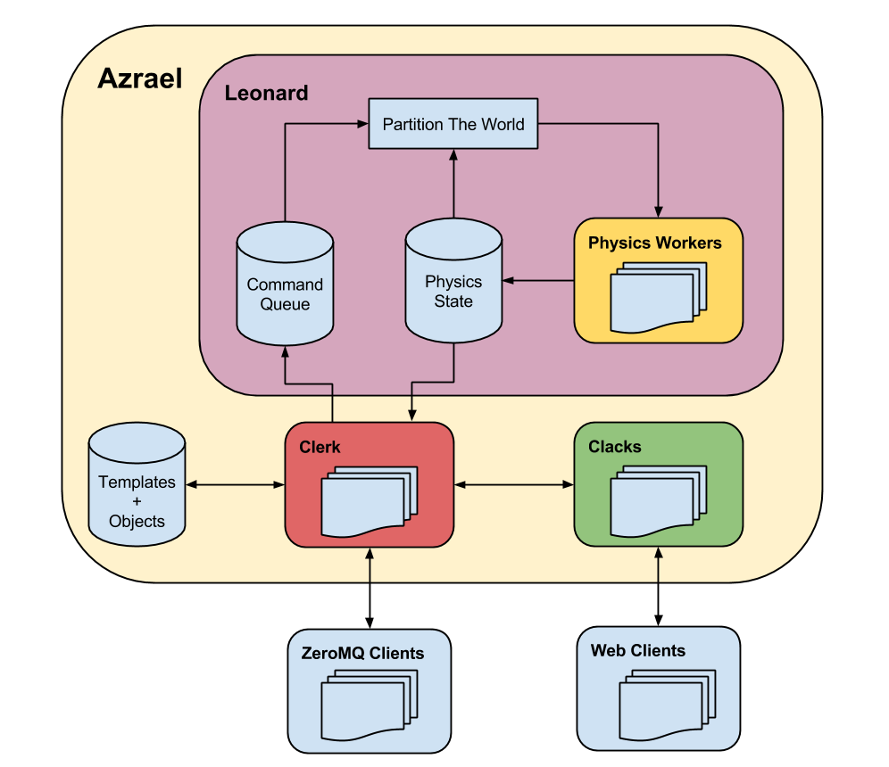

========
Overview
========

A game engine for scientists, engineers, and enthusiasts.

The aim is to provide an environment for prototyping real world devices (even
fictional ones) like drones, space ships or anything else you can imagine.

To avoid wrong expectations: Azrael emphasises accurate physics, not game play,
frame rates, or graphic effects.

Why do I bother? Because in a reasonably realistic virtual world I can have my
own space shuttle, design my own sub-marine, invent my own autonomous Mars
rover, launch my own Rosetta mission, design my own reusable rocket, or build
my own automated fleet of space ships. And so can you.

Basic Mechanics
===============

In Azrael you need to first define and spawn an object. If that object has
boosters then you can control them via commands, otherwise it will just
"float" in space.

To manoeuvre the object you need a client to send commands to its boosters.
This will accelerate your space-ship/car/submarine accordingly. It is up to you
whether you want to control these parts manually or use a clever algorithm to
do it automatically.

Clients can also query meshes and textures from Azrael for the purpose of
rendering them. For now, Azrael ships with proof-of-concept viewers. One runs
in your browser and the other uses Qt/OpenGL.

Contribute And Earn Positive Karma
==================================

Azrael always needs more Python- and JS code (all skill levels), 3D models,
demos, a proper homepage, and more. For a broad list of topics see the
`Readme <https://github.com/olitheolix/azrael>`_, but feel free to `contact me
directly <olitheolix@gmail.com>`.

Architecture
============

Azrael is an asynchronous network of micro services. The database, Azrael API,
physics, visualisation, object control etc are all independent services and
may run on different machines.

Azrael is still in a proof-of-concept stage but the following architecture is
already in place.

In this figure *every* block is an independent micro service, and *every* arrow
is a network connection.

The Azrael API provides two interface types: ZeroMQ and HTTP (Websockets). Both
expose the exact same feature set.

ZeroMQ clients connect to a `Clerk` instance, whereas web clients connect to
`Clacks` (a Tornado server) which is a proxy for `Clerk`.

`Clerk` is the main API into Azrael. It manages all the information that goes
in and out of Azrael.

`Leonard` is the physics service. Every few Milliseconds (~50ms) it partitions
the world into collision sets (`broadphase` in physics engine jargon) and
ships them to a fleet of `Physics Workers` for the actual processing.

A `Physics Worker` is yet another service that wraps a `Bullet
<http://bulletphysics.org/>`_ engine to progress the physics for the collision
sets sent by `Leonard`.

This approach to computing physics scales... with caveats. The network overhead
is substantial because the physics engines do not share memory but have to
fetch all object properties from a database. Also, if the simulation contains
only a single broadphase set (ie all objects are close together) then the
problem does not decompose and a single Worker has to do it all.

These drawbacks notwithstanding, the general architecture works despite the
the simple (read "inefficient") implementation... and I bet there is a way to
make this truly scalable and support physics simulations of unprecedented
size.

License
=======

See the individual files/directories for the respective licenses. As a rule of
thumb, Azrael itself is licensed under the terms of the AGPL whereas all other
components (including the Python client) use the liberal Apache license.
