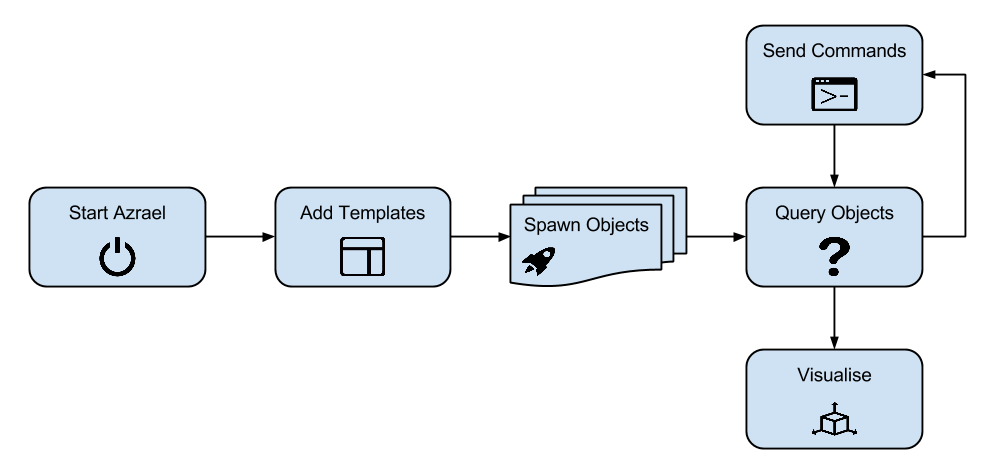
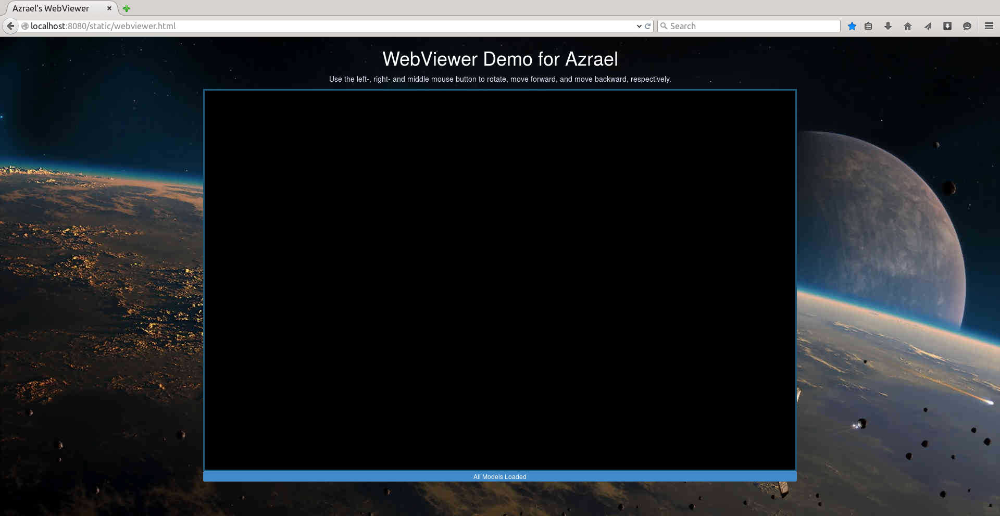
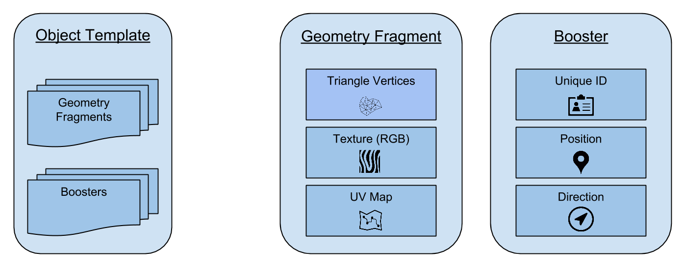
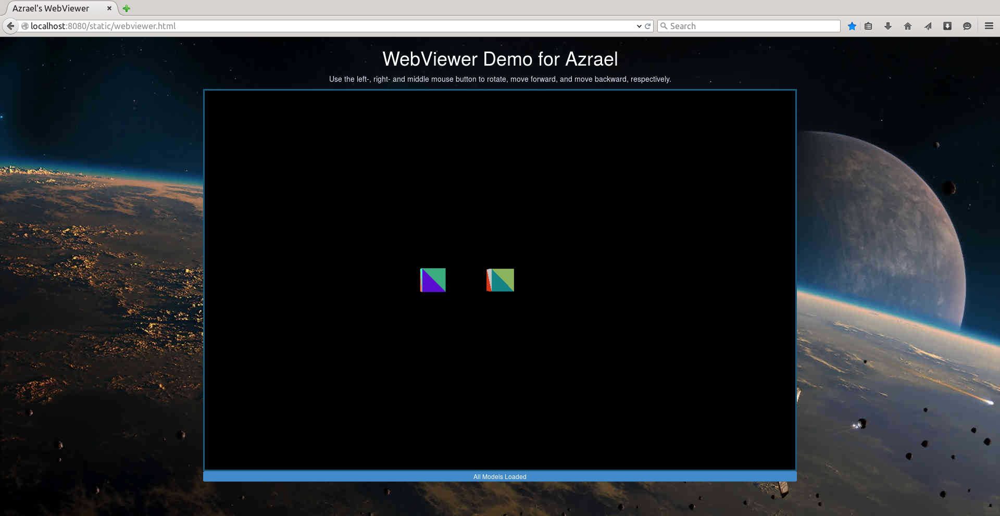

=========
Tutorials
=========

A learning-by-doing introduction to using Azrael. Here is the basic workflow to
create-, interact-, and generall "get stuff moving" in Azrael.

The following tutorials illustrate the individual steps in sufficient detail to
get started.

Start- and Stop Azrael
======================

This first tutorial shows how to start and stop Azrael.

Azrael consists of several loosly coupled processes. All of these must be
running before it does anything useful. The easiest way to not re-invent the
wheel here - it is just bolier plate code after all - is to reuse the
code from the demos.

Let's get started. Create a file `tut_1.py` somewhere with the following
content:

.. literalinclude:: tutorials/tut_1_1.py
   :language: python
   :emphasize-lines: 28, 33
   :linenos:

All this does is start Azrael, keep it running for a few seconds, then shut it
down again.

To run this demo execute the following commands:

.. code-block:: bash

   export PYTHONPATH='path-to-azrael-goes-here'
   python3 tut_1.py

On my machine this produces the following output (don't worry about what it
actually says):

.. code-block:: bash

    INFO - azrael.leonard.LeonardDistributedZeroMQ - myinfo
    INFO - azrael.clerk.Clerk - Attempt to bind <tcp://127.0.0.1:5555>
    INFO - azrael.clerk.Clerk - Listening on <tcp://127.0.0.1:5555>
    INFO - azrael.leonard.LeonardDistributedZeroMQ - Setup complete
    INFO - azrael.leonard.LeonardWorkerZeroMQ - Worker 1 connected
    INFO - azrael.leonard.LeonardWorkerZeroMQ - Worker 2 connected
    INFO - azrael.leonard.LeonardWorkerZeroMQ - Worker 3 connected

Admittedly, this demo is not very exciting in itself but a good sanity test
that everything works.

View The (So Far Empty) Scene
=============================

This tutorial slightly extends the previous so that we can view the scene. The
code itself is almost identical, except that it does not stop Azrael until we
press `<ctrl>-c`.

Create a new file called `tut_2.py` with the following content:

.. literalinclude:: tutorials/tut_2_1.py
   :language: python
   :emphasize-lines: 28, 33
   :linenos:

If you run this code and point your (recent version of Firefox/Chrome) browser
to http://localhost:8080 then you will see the scene. It should look like this:

   

Create a Template and Spawn Two Objects From It
===============================================

To fill the empty scene we are now going to add an object. Adding objects is a
two step process:

* Add a template for that object.
* Spawn (or more) instance of that template.

Templates are a complete description of an object. They comprise rigid body
data (eg position, velocity, and collision shapes), geometry (vertices,
textures, etc), and some meta data. To spawn an object in Azrael
you need to register a template for it first.

In this particular tutorial we will only consider geometry fragments. These
fragments describe the visual appearance of the body. Each fragment can be
manipulated (scale, position, rotation) independently to modify the appearance
the object as necessary. However, fragments are independent from collision
shapes and changing them does not affect the physics of the object.

The object in this tutorial is a cube without any textures. Here is the
complete code if you want to try it out immediately. It introduces quite a few
new functions, some of which I will explain below.

.. literalinclude:: tutorials/tut_3_1.py
   :language: python
   :linenos:

This time if you browse to http://localhost:8080 you will see two cubes
floating in space.

   
By the way, you can also fly through the scene with your mouse. Use the left
mouse button to navigate and the other two to move forwards and backwards.

Object With Boosters
====================

This is similar to the previous example except that the object will now have
boosters. Boosters exert a force onto the object at a pre-defined position.

Boosters are specified in the template, most notably their position and
orientation relative to the object. Once the template was spawned you can alter
the force of these boosters to accelerate the object (Azrael takes the object's
position and orientation into account before it applies the force).

.. note:: A booster in Azrael is an abstract concept only; they do not have any
          geometry or rigid body information.

In the next example we create an object with one booster. Once spawned, we
will apply random forces every second. The net effect is a somewhat
erratically accelerating cube.

.. literalinclude:: tutorials/tut_4_2.py
   :language: python
   :linenos:

Modify Fragments
================

Geometry fragments can be updated at runtime. As a simple example we will
re-use the previous demo but add a second fragment called *satellite* to the
object. Then, in the main loop, we will call the ``setFragments`` function to
modify the fragment state::

    # Send the new values to Azrael.
    satellite_state = {id_1: {
        'satellite': {'scale': 2.5, 'position': (1, 2, -3.5)},
    }}
    assert client.setFragments(satellite_state).ok

Object Textures
===============

TBA

* Endow objects with a texture

